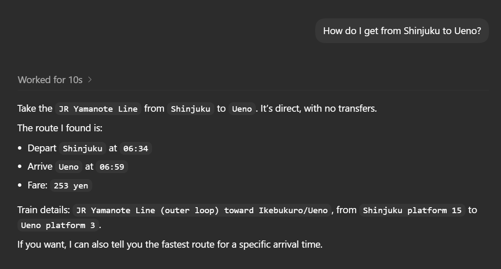
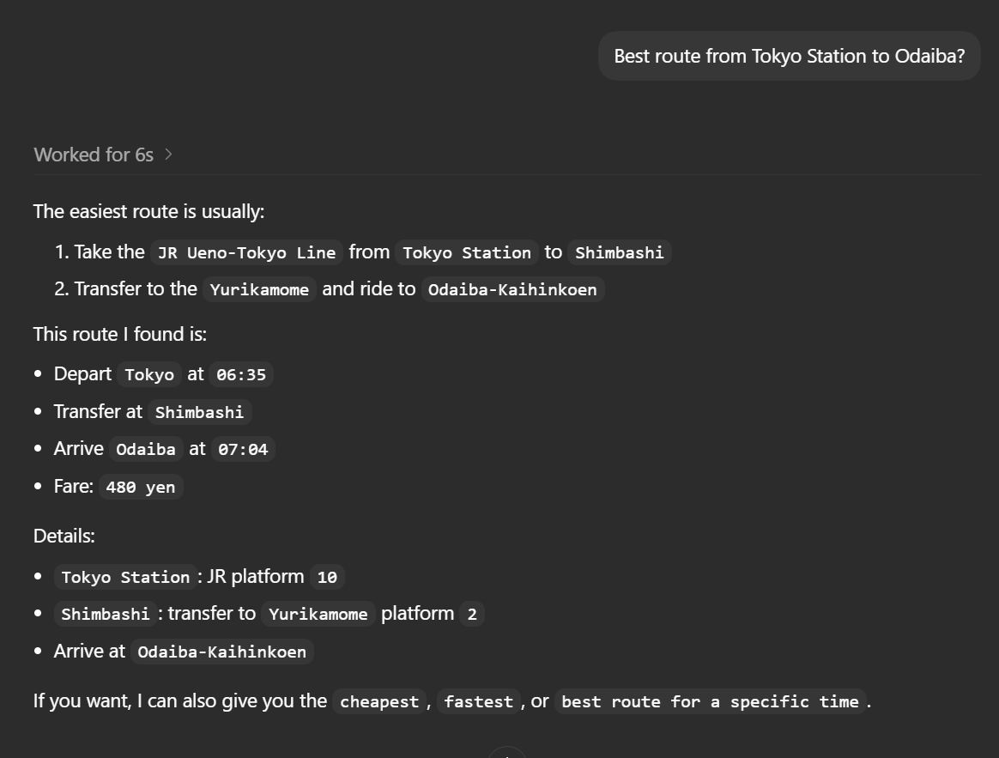
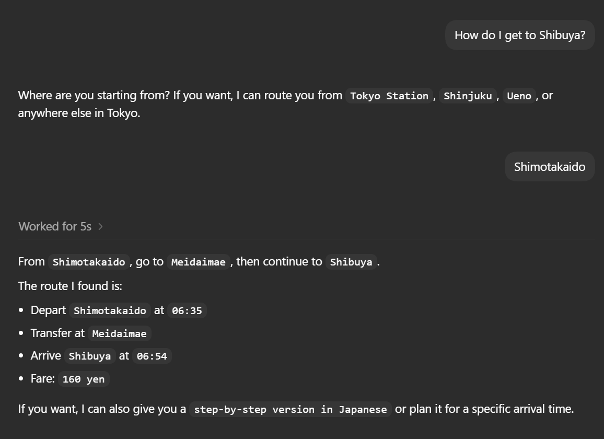

# Test Case
## Instance #1
### Test Case 01 - Basic Route Query
#### Objective
Verify the agent returns a valid transportation route.
#### Expected Behavior
- Return a valid route
- Includes transfer information (In this case, no transfer)
- Provides estimated travel time
- Avoids hallucinated stations or lines

#### Result
- [X] Pass
- [ ] Partial
- [ ] Fail

### Test Case 02 - Transfer Route
#### Objective
Verify the agent can correctly handle and recommend an appropriate transfer route across multiple train lines in Tokyo.
#### Expected Behavior
- Returns a valid route from Tokyo Station to Odaiba
- Includes realistic train line and transfer information
- Suggests practical transportation options
- Avoids hallucinated stations, routes, or travel times

#### Result
- [X] Pass
- [ ] Partial
- [ ] Fail

### Test Case 03 - Ambiguous Destination Query
#### Objective
Verify the agent appropriately handles ambiguous transportation requests by asking a clarifying follow-up question before generating a route.
#### Expected Behavior
- Detects that the starting location is missing
- Avoids assuming the user's departure station
- Responds with a relevant clarification question
- Maintains conversational flow instead of generating a hallucinated route

#### Result
- [X] Pass
- [ ] Partial
- [ ] Fail