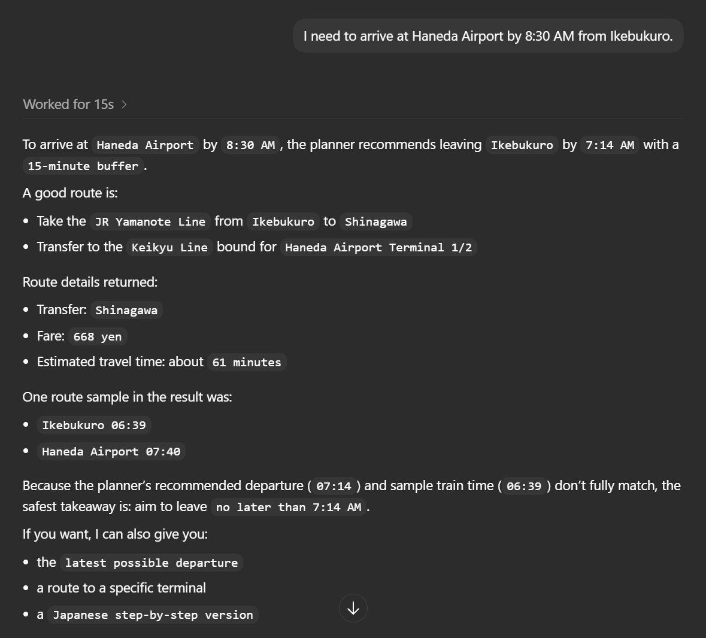
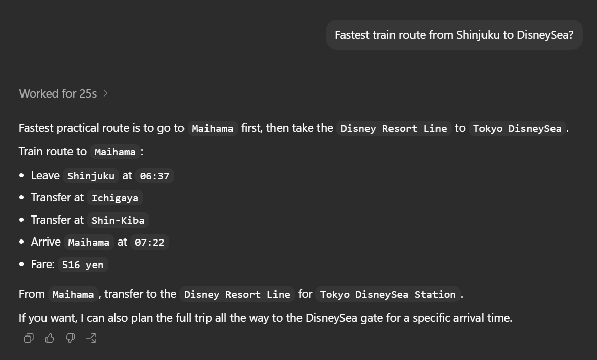

# Test Case
## Instance #1
### Test Case 01 - Basic Route Query
#### Objective
Verify the agent returns a valid transportation route.
#### Expected Behavior
- Return a valid route
- Includes transfer information (In this case, no transfer)
- Provides estimated travel time
- Avoids hallucinated stations or lines

#### Result
- [X] Pass
- [ ] Partial
- [ ] Fail

### Test Case 02 - Transfer Route
#### Objective
Verify the agent can correctly handle and recommend an appropriate transfer route across multiple train lines in Tokyo.
#### Expected Behavior
- Returns a valid route from Tokyo Station to Odaiba
- Includes realistic train line and transfer information
- Suggests practical transportation options
- Avoids hallucinated stations, routes, or travel times

#### Result
- [X] Pass
- [ ] Partial
- [ ] Fail

### Test Case 03 - Ambiguous Destination Query
#### Objective
Verify the agent appropriately handles ambiguous transportation requests by asking a clarifying follow-up question before generating a route.
#### Expected Behavior
- Detects that the starting location is missing
- Avoids assuming the user's departure station
- Responds with a relevant clarification question
- Maintains conversational flow instead of generating a hallucinated route

#### Result
- [X] Pass
- [ ] Partial
- [ ] Fail

### Test Case 04 - Time-Sensitive Arrival Query
#### Objective 
Verify the agent can handle time-sensitive transportation requests that require arrival-time awareness and practical route planning.
#### Expected Behavior
- Returns a valid route from Ikebukuro to Haneda Airport
- Accounts for the requested arrival deadline of 8:30 AM
- Suggests realistic departure timing and train connections
- Prioritizes punctual and practical routing
- Avoids impossible schedules or hallucinated travel times

#### Result
- [X] Pass
- [ ] Partial
- [ ] Fail

### Test Case 05 - Alias Destination and Fare Calculation
#### Objective
Verify the agent can correctly interpret common destination aliases and accurately calculate fares across multi-step routes that includes walking segments.
#### Expected Behavior
- Correctly interprets "DisneySea" as Tokyo DisneySea
- Returns a valid route from Shinjuku to Tokyo DisneySea
- Correctly handles routes containing walking transfers between transportation legs
- Accurately sums fare totals across all applicable train segments
- Avoids incorrect fare aggregation or skipped transportation costs

#### Result
- [ ] Pass
- [ ] Partial
- [X] Fail

#### Observed Issue
The route itself was generated correctly, but the total fare calculation was inaccurate. The agent failed to properly aggregate fares when a walking segment existed between transportation legs. As a result, one of the train segment fares was omitted from the final total.